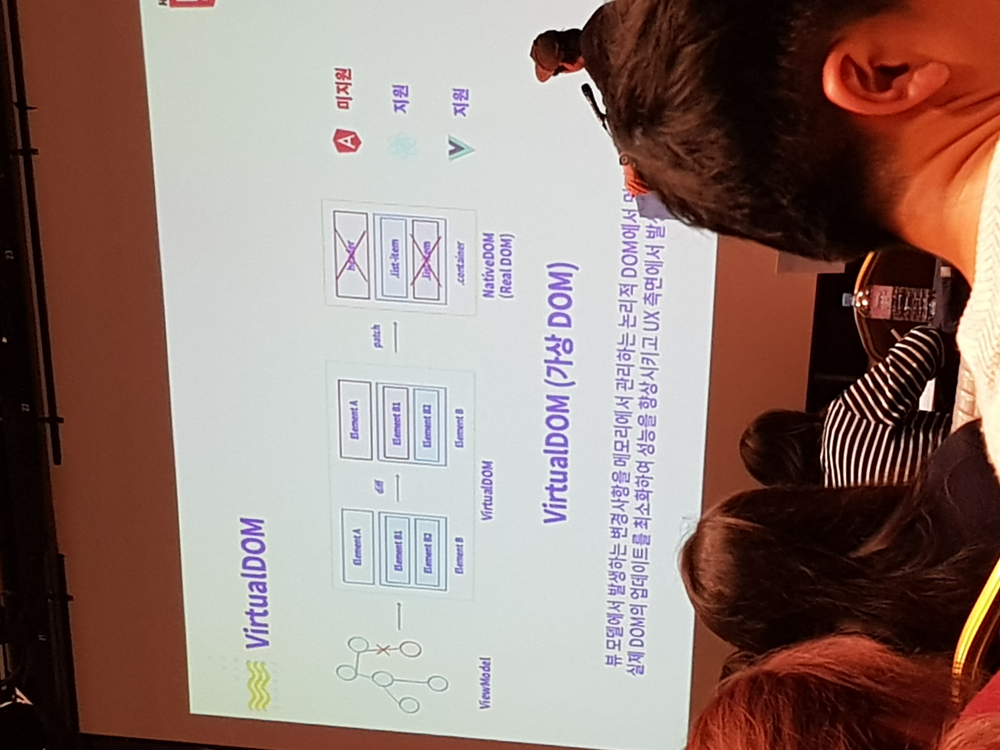

11월 26일 월요일, 코엑스에서 진행되는 W3C HTML5 컨퍼런스에 참석하였다.
오전 9시부터 오후 6시까지 진행되는 행사였는데, 별개의 세부 주제를 다루는 트랙을 선택하여 듣는 방식이었다.

그 중에서 나는 앞으로의 Web API의 동향과, 웹 기술에서 요즘에 대두되고 있는 프레임워크 및 라이브러리인
React / Angular / VueJS 에 대한 내부 동작과정 및 서비스 적용 사례, PWA 에 대한 소개 및 발표를 들었고,
외부에서 HTML5 기반 웹 개발 기술 컨텐츠에 대한 주력으로 하는 여러 기업들의 전시부스를 돌아보았다.

웹에 대한 깊이 있는 설명과 구체적인 현재 이슈, 앞으로의 발전 방향까지 들음으로써 전반적으로 간단하게나마 웹개발에 대해 이해할 수 있는 시간이었고,
개발의 세계는 깊고 훌륭한 개발자는 많다는 것을 다시 한번 느끼게 되었다.

컨퍼런스에서 다룬 내용 중 몇 가지를 간략하게 요약하자면 다음과 같다.

>앞으로의 Web API 의 동향 (문상환 님/ W3C TAG 멤버)
1) PWA
2) NFC, Sensors
3) Clipboard API v2(텍스트만 가능했던 과거 API에서 복잡한 데이터 구조에 대한 지원 강화. 웹 그래픽 에디터, 캐드 등에서 할용 가능할 것으로 전망.)
4) WebGPU (WebGL의 뒤를 이을 표준, 4대 브라우져 전부 구현 예정)
등...

>민간 분야 노플러그인 전환 가이드라인(최영준 님/한국인터넷진흥원)

*-기본 방향- 플러그인->웹 표준 솔루션(무설치) 대체

*-플러그인 사용 최소화- 이용자 중심의 웹서비스 프로세스 개선
예시) 
1) 전자결제창 - PG사가 제공하는 웹 표준 솔루션 적요
2) 그래픽 및 차트 - Canvas, SVG, WEBGL 등 활용 (20년 말 플래시 기술지원 중단)
3) 공인인증서 - 브라우저 인증서 등으로 대체
4) 웹 에디터 - 웹 표준 에디터 솔루션 활용 
등..

>PWA (Progressvie Web App) (장기효 님/KossLab)

* 프로그레시브 웹 앱이란?

모바일 앱과 같은 경험을 주는 최신 웹 앱.
앱 Icon, 앱 설치 Banner, 모바일 Push, Offline 경험 제공.

* 프로그레시브 웹 앱 등장 배경

모바일 시장의 폭발적인 성장
웹 기술로 모바일 앱 영역을 커버하기 위한 시도 ->Hybrid App, React Native

>프론트엔드 기술의 변화 (한성민 님/Naver Clova)

현재 크게 이슈가 되는 프레임워크들 - Angular, React, VueJs

Angular - 완전하고 빠른 프레임워크. 모든 기능이 내장되어 있으며 성능이 훌륭하지만, 진입장벽이 가장 높음.

React - 활발하고 오픈되어 있으며 합리적인 프레임 워크. 에코시스템이 활발하게 움직이고, 또 그것을 장려하지만, 의존과 버전에 민감하고
라이브러리 자체의 기능만으로는 부족함.

VueJs - 가볍고 친숙하며 장점만을 합쳐놓은 프레임 워크. 프레임워크 자체가 가볍고 진입장벽이 낮으며, 각 프레임워크의 장점을 흡수.
다만 크기가 커질수록 재활용성은 떨어지며, 테스트하기 어렵고 느림.

React 트렌드 및 에코시스템이 가장 활발.
VueJS가 무서운 속도로 트렌드를 따라잡고 있음.
Angular가 AngularJS까지 포함하다면 가장 크다.

마이크로 프로젝트에는 VueJS 권장.

서버사이드 렌더링이 필요한 프로젝트에는 React.

대규모의 프로젝트에는 Angular.