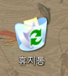

휴지통 모양을 변경하였는데,

휴지통이 비어었는 지 차있는 지가 제대로 아이콘에 적용되지 않는다.



레지스터 편집기를 열고, 다음의 경로로 이동.

> ```
> HKEY_CURRENT_USER/Software/Microsoft/Windows/CurrentVersion/
> Explorer/CLSID/{645FF040-5081-101B-9F08-00AA002F954E}/Default Icon
> ```
>

기본값, empty, full 값에 대해 모두 아이콘확장자 뒤에  **,0** 을 붙여준다.

