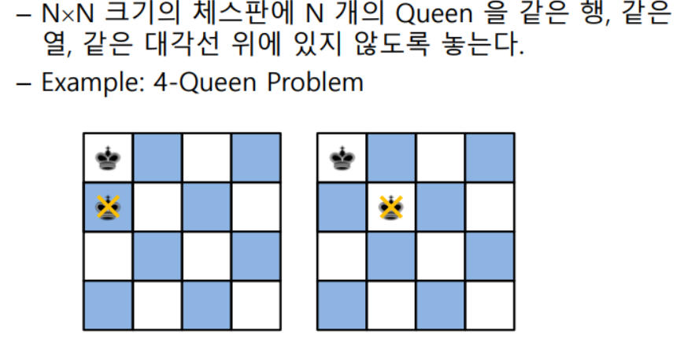
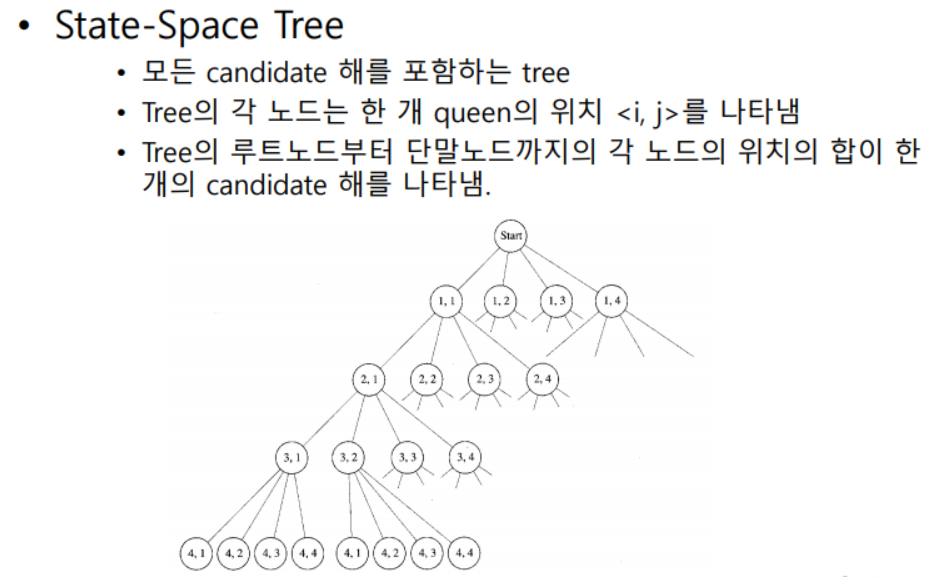

**미로 찾기의 경우처럼, 지금 상태에서 앞으로 계속 진행한다고 하더라도 해답을 구할 수 없는 경우에는 앞으로 나아가는 것을 포기하고 이전 상태로 되돌아가서 다른 경우를 찾아본다.**

```
void checknode( node v ){
    node u;
    
    if(promising(v))
    	if( there is a solution at v )
    	   write the solution
    else
    	for( each child u of v )
    		checknode (u)
}
```

------

> ###### ***N-Queen Problem***



- 4개의 queen 을 모두 다른 행에 놓으면서, 해가 되는 queen의 열의 위치가 어디인지 계산한다. (candidate 해; 모든 조합)



##### *Backtracking*

* State-space tree의 어떤 노드에서 더 이상 해를 구할 수 없는 경우, 부모노드로 되돌아가고, 그 부모노드의 다른 자식노드에서 계속 진행함.
  * State-sapce tree의 노드
    - Non-promising :  더 이상 해를 구할 수 없는 경우라고 판단되는 노드.
    - Promising
* ***Pruning***
  * State-space tree를 검색, 각 노드가 promising인지, non- promising인지를 판별.
    * Promising *>>* 계속 진행
    * Non-primising *>>* 부모노드로 돌아가서 다른 자식노드를 검사

```cpp
int isPromising(int row)
{
    int k;
    int promising;
    
    k = 0;
    promising = 1;
    while(k<row && promising)
    {
        if(col[row] == col[k] || abs(col[row]-col[k]) == row-k)
        {    promising = 0;
         	 k++;
        }
    }
    return promising;
}
```

```cpp
#define N 4
int col[N];

void nQueens(int row)
{
    int i;
    
    if(isPromising(row))
    {
        if(row == N-1)
            printNqueens();
        else
            for(i=0; i<N; i++)
            {
                col[row+1] = i;
                nQueens(row+1);
            }
    }
}
```

```cpp
void main()
{
    int i;
    
    for(i=0; i<N; i++)
    {
        col[0] = i;
        nQueens(0);
    }
}
```

------

> ###### *Knights' Tour*
>
> 체스판에서 임의의 위치에 놓여진 기사를 움직여서 모든 64개의 격자를 방문하도록 기사말을 옮기는 방법을 계산하시오. ( 단 이미 방문한 격자는 다시 방문하지 않는다.)


```cpp
#define MAXSIZE 9

#define MARK 1
#define UNMARK 0

typedef struct Point {int x, y;} point;
point direction[8] = {{1, -2}, {2,-1},{2,1},{1,2},
                      {-1,2},{-2,1},{-2,-1},{-1,-2}};

int board[MAXSIZE][MAXSIZE], path[MAXSIZE][MAXSIZE];

int knightTour (int m, int n, point pos, int counter)
{
    int i;
    point next;
    
    if(counter == m*n)
        return 1;
    
    for(i=0; i<8; i++)
    {
        next.x = pos.x + direction[i].x;
        next.y = pos.y + direction[i].y;
        
        if( next.x >0 && next.x <= n &&
            next.y >0 && next.y <= m &&
            board[next.y][next.x] != MARK)
        {
            board[next.y][next.x] = MARK;
            path[next.y][next.x] = counter + 1;
            
            if(knightTour(m, n, next, counter+1))
                return 1;
            
            board[next.y][next.x] = UNMARK;
        }    
    }
    return 0;
}

```


keword: **Backtracking**