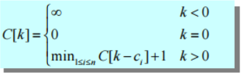

## 동적계획법 . 

**Divide - and - Conquer** 과 유사.

* 문제를 여러 개의 subproblem으로 나누고, 각각의 subproblem을 해결한 후, 원래 문제의 해답을 계산함.

* 그러나 각각의 subproblem이 독립적이지 않을 때는 매우 많은 반복 연산이 이루어지게 됨.

* dynamic programming은 이 반복 연산을 제거한다.


  * **Bottom-Up Approach**
    - 작은 문제부터 시작
    - 작은 문제를 해결한 후, 그 해답을 테이블에 저장.
    - 큰 문제를 해결하면서 작은 문제의 해답이 필요할 경우 테이블에 저장된 작은 문제의 해답을 이용.


*최적화 문제 (Optimization Problem)*

- 문제를 해결하는 해답이 여러 개 있지만, 그 중에서도 특정한 조건이 최대(혹은 최소)가 되는 해답을 구하는 문제.
  * 단계 1) 최적의 해답의 구조를 분석. (working backward 기법)
  * 단계 2) 최적의 해답의 최적값을 재귀식으로 정의(top-down)
  * 단계 3) 상향식(bottom-up)으로 최적값을 계산.
    -  이때 이미 계산한 작은 데이터에 대한 해답은 테이블에 저장 후, 필요한 경우에는 저장된 해답을 바로 사용한다.
  * 단계 4) 최적의 해답계산. 단계 3에서 발생하는 정보를 이용. reconsturct.

------


#### 1차 동적계획법

- 재귀식에서 1개의 변수가 필요. 1차원 배열로 동적계획법 구현.

> ##### **Fibnonacci 수 계산**

simple recursive program

```cpp
int fib(int n)
{
    if(n<= 1)
        return n;
    else
        return fib(n-1) + fib(n-2);
}
```

bottom-up ( Tabulated ) version

```cpp
int fib(int n)
{
    int i, Fib[100];
    
    Fib[0] = 0;
    Fib[1] = 1; /* base case */
    
    for(i = 2; i<=n; i++)
        Fib[i] = Fib[i-1] + Fib[i-2];
    
    return F[n];
}
```

> ##### **동전 교환 문제**

서로 다른 단위의 동전이 주어졌을 때, 거스름돈을 동전의 개수가 최소가 되도록 교환해 주려고 한다. 이 때 교환해 주는 동전의 최소 개수와 교환해 주는 동전의 조합을 계산하시오.  (단, 모든 단위의 동전은 무수히 많다.)

 - 예
   - 동전의 종류: 1원, 5원, 10원, 21원, 25원
   -  거스름돈 63원
     - 최소 동전 개수 : 3개 , {21, 21, 21}


>  단계1)  **Think Working Backward**

- 동전조합의 구조 분석

거스름돈 63원은, 

1. **25원 + 38원**

2.  **21원+ 42원**

3.  **10원 + 53원**

4.  **5원 + 58원**

5.  **1원 + 62원** 이다.


>  단계2) 재귀식

C(k) : k원을 바꿀 때, 최소 동전의 개수

C(63) = min{C(38)+ 1, C(42)+1, C(53)+ 1, C(58)+ 1, C(62)+ 1}

​	 = min{C(38), C(42), C(53), C(58), C(62) } + 1


>  단계3)  최소동전의 개수 계산 (Compute **Bottom Up**)





S[k] : 위의 C[k]를 계산할 때, 최솟값으로 선택된 동전을 저장.

```cpp
void coinExchange(int coins[], int numDiffCoins, int change, int coinsUsed[], int lastCoin[])
{
    int cents , j;
    coinsUsed[0]= lastCoin[0] = 0;
    
    for(cents = 1; cents <= change; cents++)
    {
        int minCoins, newCoin;
        
        minCoins = cents;
        newCoin = 1;
        for(j = 0; j< numDiffCoins; j++)
        {
            if(coins[j] > cents)
                continue;
            if(coinsUsed[cents-coins[j]] + 1 < minCoins)
            { 
                minCoins = coinsUsed[cents-coins[j]] + 1;
                newCoin = coins[j];
            }
        }
    	coinUsed[cents] = minCoins;
  		lastCoin[cents] = newCoin;
    }   
}
```

> 단계 4) 최소 동전 집합 계산 (recurisve)

위에서 1차원 배열 lastCoin[]을 이용한다.

```cpp
void reconstruct(int change, int lastCoin[])
{
    if(change > 0)
    {
        reconstruct(change - lastCoin[change], lastCoin);
        printf("%d", lastCoin[change]);
    }
}
```

keyword: **Dynamic Programming**