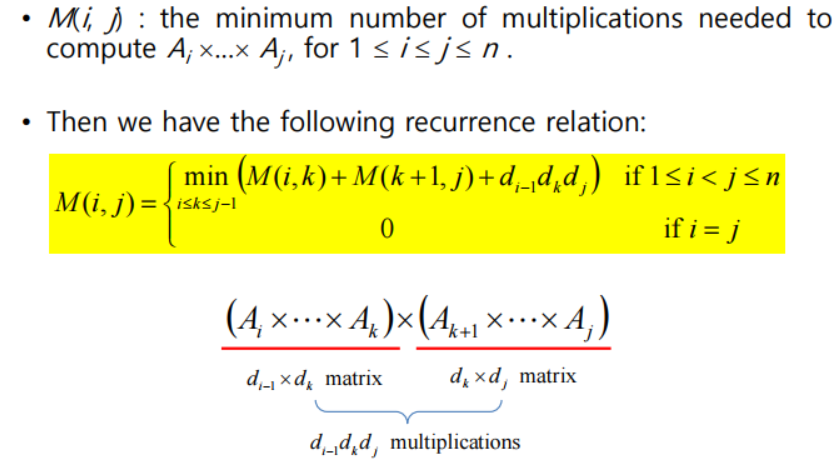

#### 2차 동적계획법 .

* 재귀식에서 2개의 변수가 필요한 문제
* 2차원 배열로 동적계획법 구현 ( 이항계수 문제, 동전교환 문제,  최장공통부분수열 문제 등...)


> ##### ***이항계수 계산문제***
>
> > 단계 1, 2) 이항계수의 구조분석 및 재귀식 
>
> 


> 단계 3) 이항계수 계산 (Bottom Up)

2차원 배열 B를 만든다.


```cpp
#define MAX 30
#define MIN (a,b) ((a)<(b)? (a):(b))

int binCoeff(int n, int k)
{
    int i, j;
    int B[MAX][MAX];
    
    for(i = 0 ; i <=n; i++)
        for(j = 0; j<=MIN(i,k); j++)
        	if(j==0 || j==i)
                B[i][j] = 1; //base case;
    		else
                B[i][j] = B[i-1][j-1] + B[i-1][j];
    
    return B[n][k];
}
```

------


> ##### ***동전교환문제 2***
>
> 서로 다른 단위의 동전이 주어졌을 때, 거스름돈을 교환해주는 동전의 조합의 수를 계산하시오. 단 모든 단위의 동전은 무수히 많다고 가정한다.
>
> 예)
>
> * 동전의 종류: 1원, 2원, 3원
> * 거스름돈 4원
>   - 교환 방법: 4가지 {1, 1, 1, 1} , {1, 1, 2} , {2, 2} , {1, 3}


>  단계 1) 동전 조합의 구조 분석 (Think Working Backward)

* 동전의 종류 : n 가지

* 거스름 돈 : k 원


거스름돈 k원의 동전조합

1. 동전조합에 Cn원 동전이 포함되지 않은 경우.
2.  동전조합에 Cn원 동전이 적어도 1개 포함된 경우.


> 단계 2) 재귀식

거스름돈 k원의 동전조합

* **N (n, K)**

1. 동전조합에 Cn원 동전이 포함되지 않은 경우.

   * **N (n-1, K)**

2.  동전조합에 Cn원 동전이 적어도 1개 포함된 경우.

   * **N(n, K - Cn)**


-> ***N(n, K) = N (n-1, K) + N (n, K-Cn)***


> 단계3) 동전조합의 수 계산 ( Compute Bottom Up )

2차원 배열 N을 만든다.


```cpp
#define MAX_COINS 101
#define MAX_CHANGE 1001

int countCoinExchange(int coins[], int numDiffCoins, int change)
{
    int i, j, numComb;
    int N[MAX_COINS][MAX_CHANGE] = {0};
    
    //base case
    for(i = 1; i <= numDiffCoins; i++)
        N[i][0] = 1;
    for(i = 1; i <= change; i++)
        N[0][i] = 0;
    
    for(i = 1; i <=numDiffCoins; i++)
        for(j = 1; j <= change; j++)
        {
            if (j - coins[i] < 0 ) //base case
                numComb = 0;
            else
                numComb = N[i][j-coins[i]];
            N[i][j] = N[i-1][j] + numComb;
        }
    return N[numDiffCoins][change];
}
```

------

> ##### ***Longest Common Subsequence (최장 공통부분 수열/스트링)***


1. 최장 공통부분 스트링의 길이를 구하여라.
2.  최장 공통부분 스트링을 찾아라.

> 단계1) Think Working Backward

끝 글자가 같을 때, 다를 때를 구분해야 한다.

> 단계2) 재귀식


> 단계3) LCS 길이 계산 (Compute Bottom Up)


```cpp
#define MAX_LENGTH 101
#define MAX(a,b) ((a)>(b) ? (a):(b))

int L[MAX_LENGTH][MAX_LENGTH], S[MAX_LENGTH][MAX_LENGTH];

int lengthLCS(char s[], char t[], int m, int n)
{
    int i, j;
    
    //base cases
    for(i=0; i<=m; i++)
        L[i][0] = 0;
    for(i=0; i<=n; i++)
        L[0][i] = 0;
    
    for(i=1; i<=m; i++)
        for(j=1; j<=n; j++)
        {
            if(s[i-1] == t[j-1]){
                L[i][j] = L[i-1][j-1]+1;
                S[i][j] = 0;
            }
            else {
                L[i][j] = MAX(L[i][j-1], L[i-1][j]);
                if(L[i][j] == L[i][j-1])
                    S[i][j] = 1;
                else
                    S[i][j] = 2;
            }
        }
    return L[m][n];
}
```

------

> ##### ***Chained Matrix Multiplication***

행렬 A의 size가 p × q 이고, 행렬 B의 size가 q × r일 때,

행렬 C = AB 를 계산할 때, p × q × r 번의 곱셈 연산이 필요하다.

> 행렬 곱셈은 associative 하다. 따라서 
>
> (AB)C = A(BC)이다. 하지만, 각 필요한 곱셈의 수는 다르다.
>
> *How should we compute A1 × A2 × ... An ×*
>
> *and what is the minimum number of elementary multiplications needed?* 

> 단계1) 연속행렬곱셈의 구조 분석(Think Working Backward)

* 행렬의 요소는 다음과 같이 가정할 수 있다.

(A_i × ... × A_k) × (A_k+1 × ... × A_j)

각 행렬의 dimension은 d_i-1 × d_k  와 d_k × d_j 이다.

> 단계2) 재귀식 



> 단계3) Compute Bottom Up


```cpp
#define MAX_SIZE 500

int minmult( int n, const int d[], int P[][])
{
    int i, j ,k, diagonal;
    int M[MAX_SIZE][MAX_SIZE];
    
    for(i = 1; i<= n; i++)
        M[i][i] = 0;
    
    for(diagonal = 1; diagonal <= n-1; diagonal++)
    {
       for(i= 1; i<= n-diagonal; i++){
          j = i+ diagonal;
           //minimun range in i<= k <=j-1.
          M[i][j] = minimum(M[i][k] + M[k+1][j] + d[i-1] * d[k] *d[j]);
           
           //P 는 reconstruction을 위해 사용할 것임
          P[i][j] = a value of k that gave the minimum;
        }
    }
    return M[1][n];
}
```

------

* Time Complexity 

(n-diagonal) × (diagonal) 을 n-1번 반복..

= n(n-1)(n+1)/6 ∈ **O(n^3)**

> 단계4) Reconstruction
>
> Algorithm printing optimal order

```cpp
void order(int i, int j)
{
    if(i == j)
        cout<<"A"<<i;
    else{
        k = P[i][j];
        cout<<"(";
        order(i,k);
        order(k+1,j);
        cout<<")";
    }
}
```

------

keyword : **Dynamic Programming**