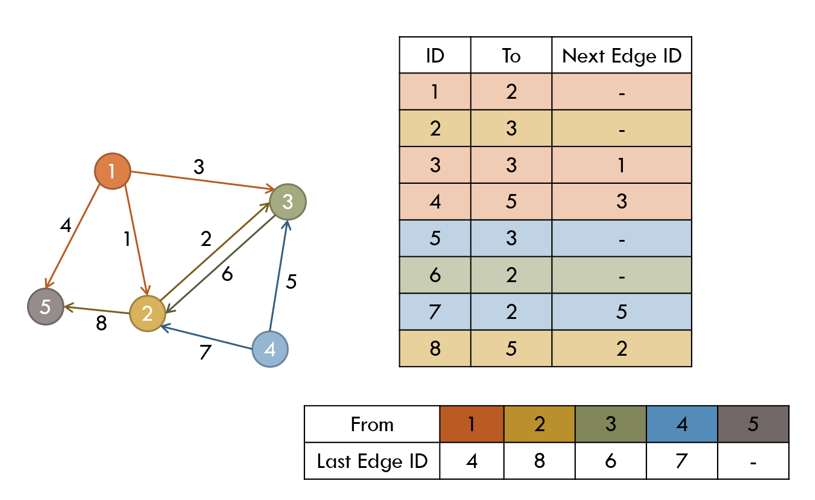
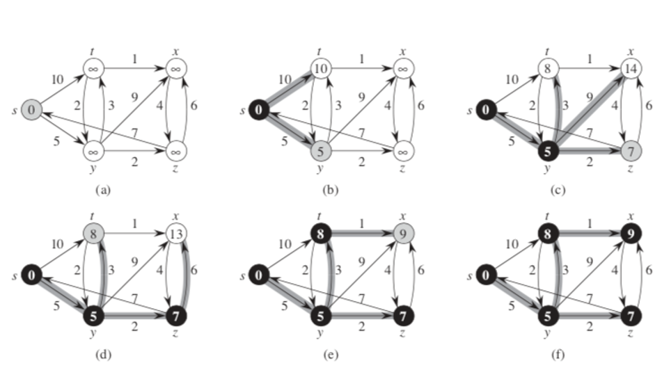
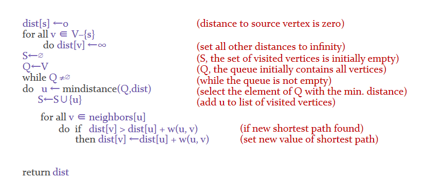
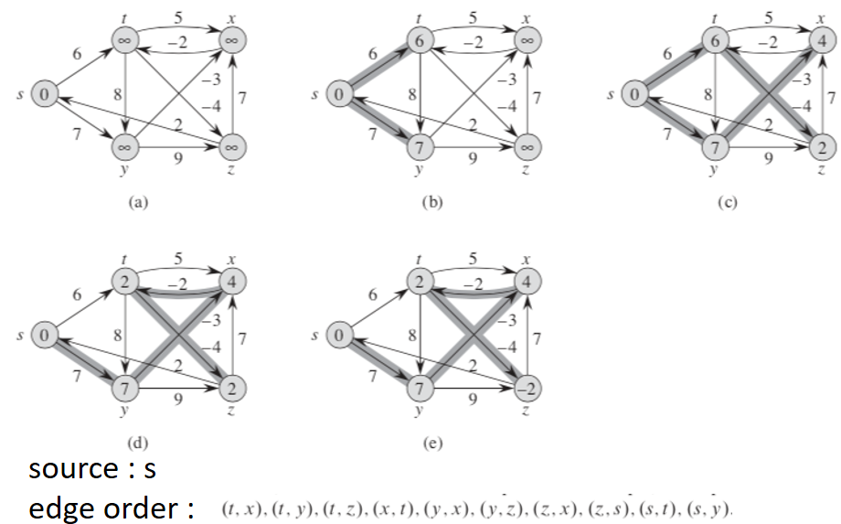

### 그래프 알고리즘 .

------

* #### **그래프의 표현**

  그래프는 *Adjacency matrix(인접행렬)* 이나 *Adjacency list(인접 리스트)*로 나타낼 수 있다.

  **인접 행렬**은 connectivity 정보를 저장하기 쉽지만, 행렬의 크기가 너무 커지게 되면 적합하지 않을 수 있다.

  **인접리스트**는 각각의 노드에서 뻗어가는 edge들을 리스트로 갖는다.

  * 인접 리스트의 구현

        1. linked list 이용
    
              너무 많은 메모리/시간 오버헤드 가능성 존재
    
        2.  vector STL 이용
    
              코딩이 쉬우나 메모리 이슈 존재. 느림.
    
        3.  array 이용
    
              edges의 total number를 알 때 사용. 메모리 효율적.

             * Implementation Using Arrays

  

-----
* #### Graph Traversal

  * 그래프를 순회하는 알고리즘

      * **DFS** (Depth-First-Search) : recursion (stack) 을 이용
      * **BFS** (Breadth-First Search) : queue를 이용

  * > **DFS**

      vertex v에서 도달할 수 있는 모든 노드를 depth-first-order로 방문한다.

      만약 recursion depth가 너무 크다면 stack(스택)을 이용해 non-recursive로 구현 할 수 있다.

      * 방문하는 그래프에 visited 마킹하고 스택에 집어넣는다. 
      * 스택이 비어있지 않은 동안 스택의 top node를 *peek* 해보고, 만약 방문하지 않은 자식 노드가 남아있다면 visited 마킹을 하고 그 자식 노드를 다시 스택에 집어 넣는다.
      * 만약 방문하지 않은 노드가 없다면 스택에서 top node를 꺼낸다.

  * > **BFS**

      vertex v에서 도달할 수 있는 모든 노드를 breadth-first-order로 방문한다.

      * queue(큐)를 초기화한다. 
      * 방문하는 그래프에 visited 마킹을 하고 큐에 집어넣는다.
      * 큐가 비어 있지 않다면 큐의 front element를 꺼낸다.

      * 꺼낼 때 front element의 child 노드를 다시 큐에 넣는다.

------

* #### MST (Minimum Spanning Tree)

  * undirected weighted graph G = (V, E)가 주어졌을 때, 모든 노드를 연결하는 최소 total weight의 edges 집합을 구하고 싶을 때 2가지의 greedy algorithm을 이용할 수 있다.

  * > **Kruskal's algorithm**

      * weight가 작은 edge부터 택해, 해당 edge를 포함하면 cycle이 형성되는지 확인한다. 만약 형성되지 않으면 해당 edge를 포함하고 아니면 버린다.
      * (V-1)개의 edges가 포함될 때까지 위의 과정을 반복한다.

  * > **Prim's algorithm**

      * single node에서부터 시작하여 smallest weigted edge를 연결해나간다.
      * single supernode에서 점차 자라나간다는게 동시에 여러개의 노드그룹이 생길 수 있는 kruskal과 구별되는 점이다.

------

* #### Single-Source Shortest Path

  * 출발 vertex에서 모든 다른 vertices로의 가장 짧은 path를 찾는 문제.

  * Weighted graph G = (E, V),  Source vertex s ∈ V to all verices v ∈ V.

      * **Dijkstra's algorithm**: nonnegative weights의 그래프에서 동작한다.
      * **Bellman-Ford algorithm:** negative weights의 그래프에서도 동작한다. 

  * > **Dijkstra's algorithm**

    

    

  * > **Bellman-Ford Algorithm**

    

     
      for each vertex v in V
      	if v==source, d[v] = 0
      	else d[v] = infinity
      
      for i = 1 to |V|-1
      	for each edge (u, v) in E
      		if d[v]>d[u]+ weight[u,v]
      		   d[v] = d[u]+ weight[u,v]
      
      for each edge (u,v) in E
        if d[v] > d[u] + weight[u,v]
            return false //there is a negative cycle
      
      return true

------

* #### All - Pairs Shortest Paths

  * Proglem of finding shortest paths betwen all pairs of vertices in a graph (with negative edges, but no negative-weight cycle)
    * **matrix multiplication**
    * **Floyd-Warshall algorithm**

------