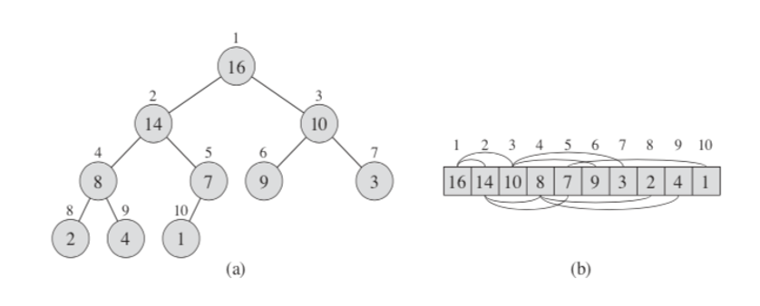

* **Complete Binary Tree**

  - bottom level을 제외하면 왼쪽 차일드와 오른쪽 차일드가 전부 차있는 트리.

* ##### **Binary Heap**

  * Heap property를 갖고 있는 complete binary tree이다.
    * *max-heap property* : A[Parent(i) >= A[i]]
    * *min-heap property* : A[Parent(i) =< A[i]]

* ***Heap Sort***
  * (최대힙 이용 케이스) 최대 힙을 구성한 뒤, 루트에 위치한 가장 큰 수와 가장 작은 수를 교환한다. 다시 최대 힙을 구성한다. 이와 같은 동작을 반복한다. 