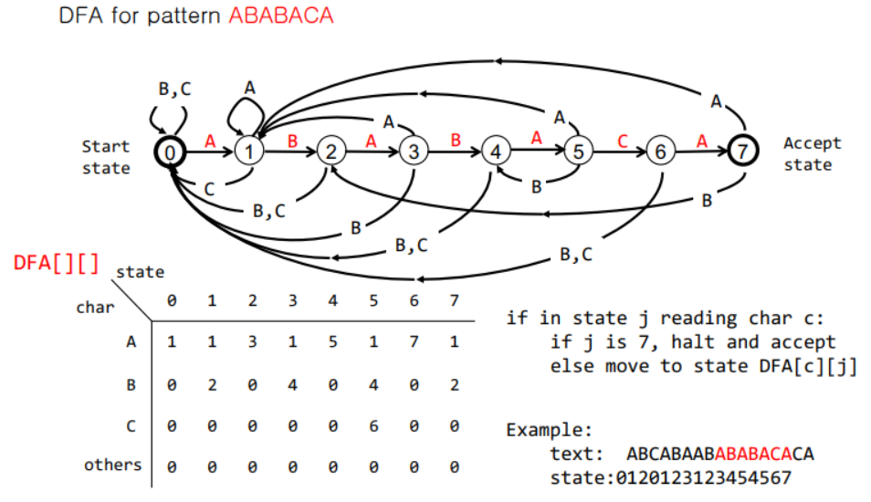

### Substring search

> **N의 길이의 text에서 M 길이의 패턴을 찾아라.**


* #### **Brute - Force Substring Search**

  * *Naive Algorithm*

    * 각각의 text 위치에 대해 패턴과 같은지 찾기. 최악의 경우 (text와 패턴이 반복이 많은 문자일 때) 복잡도 O(MN).

    ```cpp
    int naiveStringMatch(char text[], char pattern[])
    {
        int patLength, txtLength;
        
        patLength = strlen(pattern);
        txtLength = strlen(text);
        
        for(int i=0; i<= txtLength - patLength; i++)
        {
            for(int j=0; j<patLength; j++)
                if(text[i+j] !=pattern[j])
                    break;
            if(j == patLength)
                return i;
        }
        return -1;
    }
    ```

    

  * Improvement

    * Avoid **backup**. 
    * 나이브한 알고리즘은 미스매치가 일어날 때마다 되돌아간다. linear time algorithm이 필요하다.

    ------

* #### KMP (Knuth-Morris-Pratt) Algorithm

  * backup을 피하는 알고리즘이다.

  

* ##### **Algorithm with DFA (Deterministic Finite State Automaton)**

  * 먼저 패턴을 통해 DFA 2차원 배열을 계산해놓아야 한다.
  * text pointer의 backup이 없는 알고리즘이다.  복잡도 O(N). 

  

  ```cpp
  //patLength = strlen(pattern);
  int KMP(char text[])
  {
      int i, j, txtLength;
      
      txtLength = strlen(text);
      
      for(i=0; j=0; i <= txtLength && j< patLength; i++)
          j = DFA[text[i]][j]; //text[i] to be modified
      
      if(j == patLength)
          return i - patLength;
      else
          return -1;
  }
  ```

  * ***DFA Construction***  : A Linear Time Algorithm

  ```cpp
  /* 각 state j에 대해:
  	match case 면 DFA[pattern[j]][j] = j+1
  	mismatch case면 DFA[][X]를 DFA[][j]에 복사
  	X를 업데이트
  */
  
  int DFA[MAX_SIZE][MAX_SIZE];
  int R; //text character set size
  
  void constructDFA(char pattern[])
  {
      int patLength = strlen(pattern);
      DFA[pattern[0]][0] = 1;
      
      for(int X=0; j=1; j<patLength; j++)
      {
          for(int c=0; c<R; c++) //copy mismatch cases
              DFA[c][j] = DFA[c][X];
          
          DFA[pattern[j]][j] = j+1; // copy match case
          X = DFA[pattern[j]][X]; //update X
      }
  }
  ```

* **KMP Algorithm**

  > getFail 함수 ( prefix, suffix 비교하여 같은 개수 구한다)

  ```cpp
  vector<int> getFail(string pattern)
  {
      int m = (int) pattern.size();
      int j=0;
      vector<int> fail(m,0);
      
      for(int i=1; i<m; i++)
      {
          while(j >0 &&pattern[i] != pattern[j])
              j = fail[j-1];
          if(pattern[i] == pattern[j])
              fail[i] = ++j;
          else fail[i] = j;
      }
      return fail;
  }
  ```

  > kmp 코드 구현

  ```cpp
  vector<int> kmp(string text, string pattern)
  {
      vector<int> ans;
      fail = getFail(pattern); //failure function
      int n = text.size(); m = pattern.size();
      int j = 0; // j : index of pattern
      
      for(int i=0; i<n; i++) // i: index of text
      {
          while(j>0 && text[i] !=pattern[j])
              j = fail[j-1];
          if(text[i] == pattern[j])
          {
              if(j==m-1) //pattern matching is found
              {   //save the matched position
                  ans.push_back(i-j);
                  j = fail[j];
              }
          	else
              	j++;
          }
      }
      return ans;
  }
  ```
